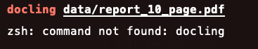

# Different document parsers
### Setup steps
- Make sure you have `uv` installed. Refer to this [video](https://youtu.be/13eNodHGRjw?si=UJdgZQ_EcWHueMly) for getting started.
- Clone the repo `https://github.com/sudarshan-koirala/youtube-stuffs.git`
- Navigate inside the repo to `document-parsers` folder. From the root of the directory/folder , run `uv sync`
    - this will create the virtual env
    - Install all the necessary packages
    - If you use uv to run the file, no need to activate it, it will do it for you.
    - If you decided not to use uv to run file, you can activate the virtual env with `source .venv/bin/activate`
    - Example, `uv run docling data/page_24.pdf` vs `docling data/page_24.pdf`  
     vs 
- If there is problem with tessaract, use other OCR types but if you want to use tessaract, this might help
```
uv remove tesserocr
uv pip install --no-binary :all: tesserocr
```

--- 
If you don't want to use `uv`
- Create virtual env and activate it `python3 -m venv .venv && source .venv/bin/activate`
- Install all necessary packages from `pyproject.toml` file. For this following these steps.
    - First install toml package, `pip install toml`
    - Save the following in a file, example, `requirements.py` file.
    ```
    import toml

    # Path to your pyproject.toml file
    pyproject_path = "pyproject.toml"

    # Load the pyproject.toml file
    with open(pyproject_path, "r") as file:
        pyproject_data = toml.load(file)

    # Extract the dependencies section
    dependencies = pyproject_data.get("project", {}).get("dependencies", [])

    # Write the dependencies to a requirements.txt file
    with open("requirements.txt", "w") as req_file:
        req_file.writelines([dep + "\n" for dep in dependencies])

    print("Dependencies extracted and saved to requirements.txt:")
    print("\n".join(dependencies))
    ```

    - Run the python file, `python3 requirements.py`
    - Install all the packages, `pip install -r requirements.txt`